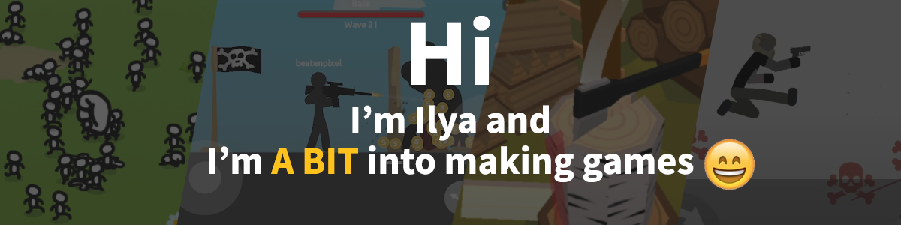

# my_stuff

### I'm 20 yo, live in St.Petersburg, Russia In this repo you can find information about me, my experience in gamedev and other stuff

### A bit of a history...
My first public game "Kill the Tigra":
The idea was to make a game about popular russian youtuber BrianMaps, so that he could film a video about it and attract his fans to play it. (spoiler - it didn't work out)  

What I haven't learned yet, but planning to:
- TestFrameworks (seems reasonable not to use them in small solo projects)

_This entire text was written without using any translators or dictionaries, so this text may give you an idea of my english writing skill_
